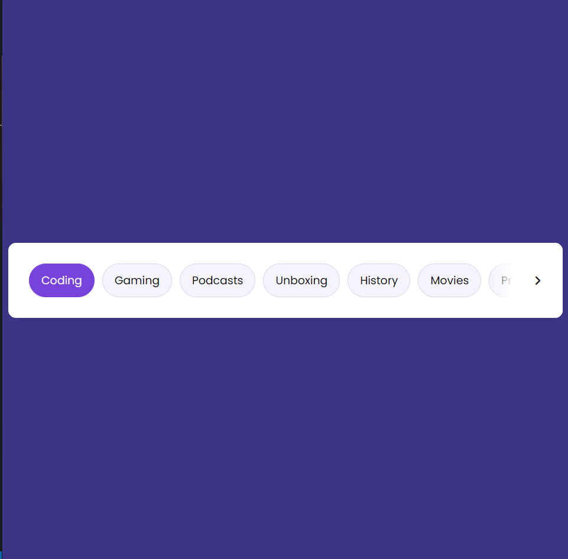

# Draggable-menu

## Welcome to the repo of the draggable menue 👋
Simple menue that is responsive and functional on desktops and mobiles.

## To understand the code 🤓
You need a basic HTML,CSS, JavaScript concepts to understand the code which is beginner friendly.

Feel free to clone it and play around a little bit.

## Demo version
You can see a demo version on the github-pages deployment.

Or just click this link 👉 [Demo Version](https://roudi22.github.io/draggable-menu/)

**Have fun coding!** 🚀
